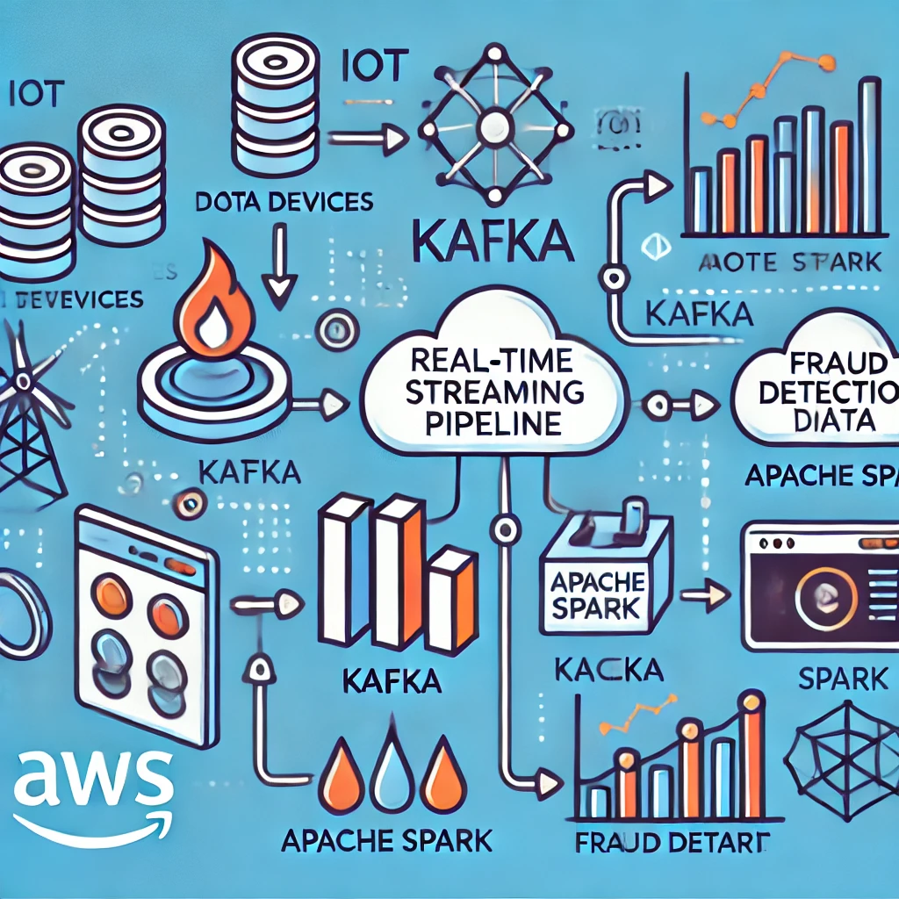
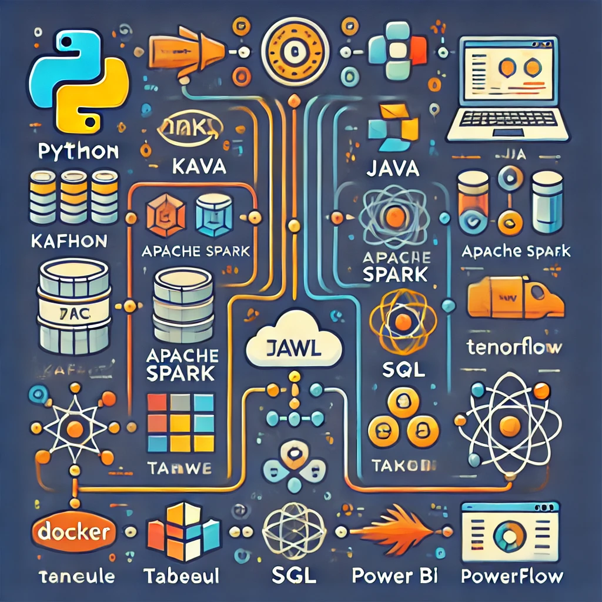
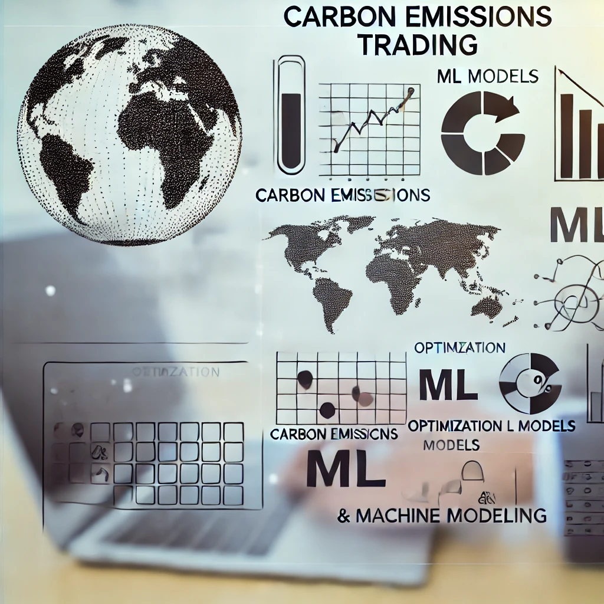
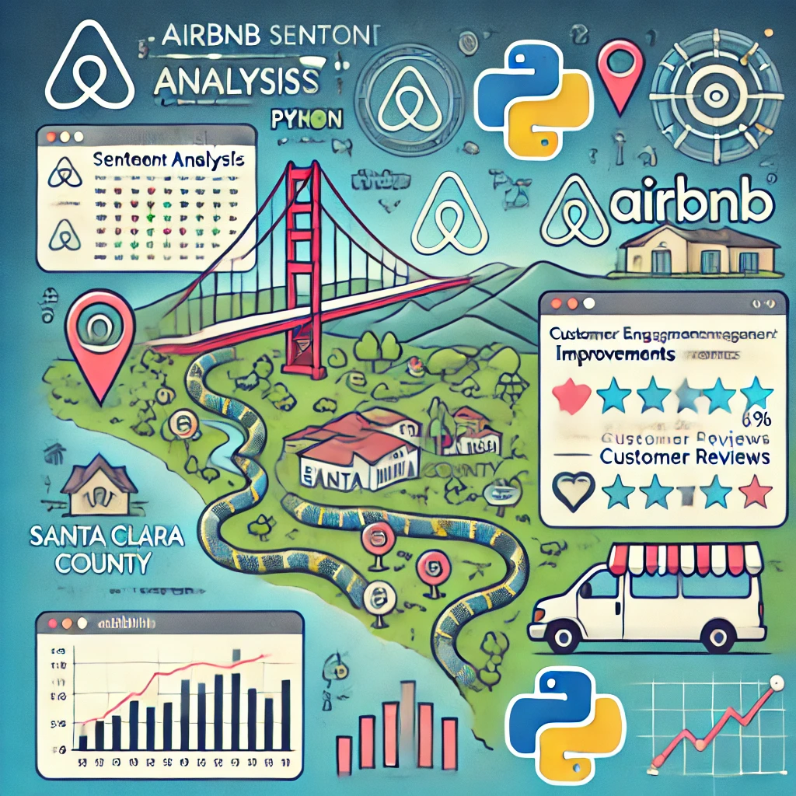

# 🌟 Prayag Nikul Purani - Data Scientist | ML Enthusiast | Tech Blogger 🌟

---

## 🌐 About Me

Hello! I am **Prayag Nikul Purani**, a passionate **ML Scientist**, **Data Engineer**, and **Tech Blogger** who loves working at the intersection of **Machine Learning**, **Big Data**, and **Cloud Computing**. 🚀

- 🔭 **Currently**: ML Data Scientist at **C/test**
- 🎓 **Education**: Master of Science in **Data Analytics**, San Jose State University
- ✍️ **Blogger**: I share my insights & experiences on **Medium** to help others grow in Data Science.
- 🧠 **Expertise**:
  - Real-time data processing & event-driven architectures
  - Fraud detection & anomaly detection systems
  - Data visualization & storytelling for business impact

---

## 🔬 Notable Projects

### 🏦 **Real-Time Smart Bank Data Streaming Capture**

📌 **Goal**: Engineered a real-time fraud detection system processing **1 million+ transactions per minute** with **99% capture rate**.

🔧 **Tech Stack**:
- **Tools**: Kafka, PySpark, AWS TimeStream, Bloom Filters, Grafana
- **Methods**: Feature Engineering, Hyperparameter Tuning, Real-Time Data Streaming

🚀 **Impact**:
- Enhanced fraud detection accuracy with **3 optimized hyperparameters**.
- **Implemented real-time dashboards** with a **1s refresh rate** using Grafana and Kibana.

---

### 🌍 **Carbon Emissions Trading Future**

📌 **Goal**: Developed a predictive model to optimize **carbon emissions trading inefficiencies**, leveraging **CNN-ANN, SVR, and LSTM models**.

🔧 **Tech Stack**:
- **Data Sources**: World Bank, NOAA Climate Data, NWS API
- **Tools**: Python, AWS Lambda, Airflow, CRISP-DM methodology
- **Methods**: Predictive Modeling, Time-Series Forecasting, MSE, MAE, R² analysis

🚀 **Impact**:
- Reduced **carbon trading inefficiencies by 20%**.
- Integrated multiple datasets for improved decision-making in climate finance.

---

### 🏡 **Airbnb Sentiment Analysis in Santa Clara County**

📌 **Goal**: Analyzed **10,000+ Airbnb reviews** to enhance customer engagement using **NLP and sentiment analysis**.

🔧 **Tech Stack**:
- **Tools**: Python, NLTK, VADER, Tableau
- **Methods**: Sentiment Analysis, NLP Preprocessing, Data Visualization

🚀 **Impact**:
- Improved **customer engagement by 10%** based on insights.
- Developed an **interactive Tableau dashboard** to monitor sentiment trends.

---

### 📊 **Global Trade Dashboard**

📌 **Goal**: Designed an **interactive BI dashboard** for **global trade analytics**, improving decision-making in international markets.

🔧 **Tech Stack**:
- **Tools**: Power BI, Tableau, SQL, Python
- **Data Sources**: World Trade Organization, UN Comtrade
- **Methods**: Data Cleaning, KPI Analysis, Predictive Trends, Data Warehousing

🚀 **Impact**:
- Improved trade **decision-making efficiency by 25%**.
- Reduced manual reporting time by automating **data ingestion & analysis**.

---

## 💻 Tech Stack

| Languages      | Frameworks & Tools    | Big Data           | Cloud        | Visualization Tools |
|----------------|-----------------------|--------------------|--------------|---------------------|
| Python         | TensorFlow, PyTorch    | Apache Spark       | AWS, GCP     | Power BI            |
| Java           | Flask, Docker          | Kafka, Snowflake   | Docker       | Tableau, Grafana    |
| SQL, R         | Keras, Scikit-learn    | Hadoop, Zookeeper  | Kubernetes   | ElasticSearch       |

---

## 📊 GitHub Stats

---

## ✍️ Latest Articles on [Medium](https://medium.com/me/stories/public)

📖 **Recent Blogs**:
- 🔥 [Boosting A/B Testing Accuracy with LLMs](https://medium.com)
- 🚀 [Building Real-Time Data Streaming Pipelines](https://medium.com)
- 🌍 [Carbon Emission Trading with Machine Learning](https://medium.com)

---

## 📬 Let’s Connect

📧 **Email**: [prayagpurani11@gmail.com](mailto:prayagpurani11@gmail.com)  
💼 **[LinkedIn](https://linkedin.com/in/prayagpurani)**  
🌐 **[Portfolio](https://www.datascienceportfol.io/prayagpurani11)**  

---
