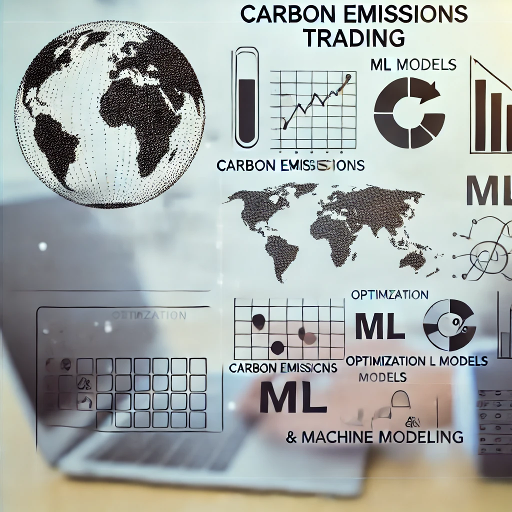

# 🌟 Prayag Nikul Purani - Data Scientist | ML Enthusiast | Tech Blogger 🌟

Welcome to my GitHub profile! I am **Prayag Nikul Purani**, a passionate **ML Scientist**, **Data Engineer**, and **Tech Blogger**. I love to explore the intersections of **Machine Learning**, **Big Data**, and **Cloud Engineering** while constantly solving real-world problems. 🚀

---

## 🌐 **About Me**

- 🔭 Currently working as an **ML Data Scientist** at **C/test**, applying **LLMs** to optimize A/B testing and improving **predictive modeling**.
- 🎓 Pursuing my **Master of Science in Data Analytics** at **San Jose State University**.
- ✍️ I also share my data science journey and insights on **Medium** to help others learn and grow with me.
- 🧠 My expertise revolves around **real-time data processing**, **fraud detection**, and **data storytelling**.

---

## 🔬 **Notable Projects**

### 🏦 **Real-Time Smart Bank Data Streaming Capture**
A **real-time streaming system** using AWS IoT, Kafka, and PySpark for fraud detection. Processed over **1 million transactions** per minute with 99% accuracy.

### 🌍 **Carbon Emissions Trading Future**
Predicted and optimized carbon emissions trading inefficiencies using data from **World Bank** and **NWS API**, reducing operational costs by 20%.

### 🏡 **Airbnb in Santa Clara County**
Conducted **sentiment analysis** on 10,000+ Airbnb reviews with Python and **Tableau** to improve customer engagement by 10%.

### 📊 **Global Trade Dashboard**
Built an interactive **global trade dashboard** that improved customer decision-making by 25% using advanced visual analytics with **Power BI** and **Tableau**.

### **Explore more of my projects on [GitHub](https://github.com/pp11-web)!**
---

## 💻 **Tech Stack**

| Languages      | Frameworks & Tools    | Big Data           | Cloud        | Visualization Tools |
|----------------|-----------------------|--------------------|--------------|---------------------|
| Python         | TensorFlow, PyTorch    | Apache Spark        | AWS, GCP     | Power BI            |
| Java           | Flask, Docker          | Kafka, Snowflake    | Docker       | Tableau, Grafana    |
| SQL, R         | Keras, Scikit-learn    | Hadoop, Zookeeper   | Kubernetes   | ElasticSearch       |

---

## 📊 **GitHub Stats**:

---

## ✍️ **Check out my latest articles on [Medium](https://medium.com/me/stories/public)**:

- [**Boosting A/B Testing Accuracy with LLMs**](https://medium.com)  
- [**Building Real-Time Data Streaming Pipelines**](https://medium.com)  
- [**Carbon Emission Trading with Machine Learning**](https://medium.com)

---

## 📬 **Let’s Connect**

- 📧 Email: [prayagpurani11@gmail.com](mailto:prayagpurani11@gmail.com)
- 💼 [LinkedIn](https://linkedin.com/in/prayagpurani)
- 🌐 [Portfolio](https://www.datascienceportfol.io/prayagpurani11)

---

